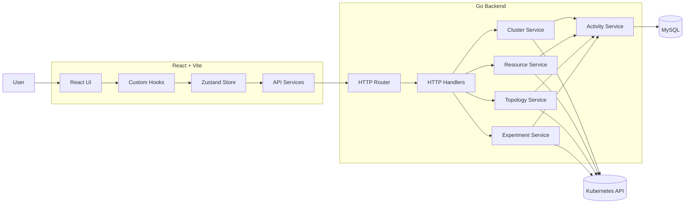

<p align="center">
  
  
  
  
  
  
  
  
</p>

# K8lab

> **A visual Kubernetes lab for inspecting cluster state, understanding
> resource relationships, and reproducing Kubernetes failure scenarios.**

K8lab is a Kubernetes visualization and experimentation platform that
provides a higher-level interface over the Kubernetes API.

It brings resource inspection, topology visualization, workload state,
experiment execution, logs, and operational activity into a single
interface, while keeping the underlying Kubernetes objects and their
behaviour visible.

The project is designed around a simple idea: **make Kubernetes
behaviour observable and reproducible without requiring every interaction
to begin with a `kubectl` command.**

------------------------------------------------------------------------


## 🎯 Why I Built This

Working with Kubernetes often requires correlating information from
multiple sources: resource specifications, object relationships,
container states, events, logs, and controller behaviour.

K8lab provides a visual layer over these primitives so that this
information can be inspected together rather than reconstructed manually
from individual commands.

The experimentation layer extends this further by allowing common
Kubernetes failure modes to be reproduced on demand, making the resulting Kubernetes state
directly observable.

------------------------------------------------------------------------

## 🎥 Demo

[▶️ Watch the K8lab Demo](https://drive.google.com/file/d/1ifUNy0jb6kMoLpXOKJpi4mWTv2WCbzVa/view?usp=sharing)


------------------------------------------------------------------------

## Core Capabilities

### Cluster Management

- Connect to configured Kubernetes clusters
- Switch between available clusters
- View cluster health and workload statistics
- Inspect cluster-level activity
- Use the selected cluster as the execution context for resource and experiment operations

### Resource Explorer

The Resources page provides an inventory view over Kubernetes objects.

- Browse workloads and Kubernetes resources
- Filter resources by resource type
- Inspect resource metadata and status
- View detailed resource information
- Inspect generated YAML representations
- Delete resources directly from the interface

### Topology Visualization

The topology service transforms Kubernetes resources into a graph representation consumed by the frontend.

Relationships between resources such as:

```text
Node
  └── Deployment
        └── ReplicaSet
              └── Pod
                    └── Container
```

can be explored visually alongside networking resources such as Services and Ingresses.

The frontend uses React Flow to provide interactive graph navigation

### Kubernetes Experiments

The experiment subsystem provides reproducible scenarios for common Kubernetes lifecycle and scheduling failures.

| Experiment | Kubernetes behaviour |
|---|---|
| **CrashLoopBackOff** | Container repeatedly terminates and is restarted |
| **ImagePullBackOff** | Container image cannot be pulled |
| **OOMKilled** | Container exceeds its memory limit |
| **Pending Pod** | Pod cannot be scheduled due to resource requirements |
| **Failed Liveness Probe** | Kubelet repeatedly restarts an unhealthy container |


Each execution receives a unique `runID` and is associated with the target cluster and experiment.

The backend uses Kubernetes labels to isolate resources belonging to a particular execution:

```text
k8lab.io/experiment=<experiment-id>
k8lab.io/run=<run-id>
```

This allows resources created by different experiment runs to be identified, monitored, stopped, and removed independently.

### Live Experiment Observability

Experiment execution is asynchronous. The backend creates the Kubernetes resources and immediately returns an `ExperimentRun`. The frontend then polls the logs endpoint while the experiment is active.

The returned log stream combines:

- **Experiment-level messages** generated by the backend
- **Raw Kubernetes container logs** retrieved through the Kubernetes API

Polling stops automatically when the run reaches a terminal state.

### Activities Storage

Important operations are recorded through the activity service rather than directly writing to the database from individual handlers.

```text
Cluster operation
       ↓
Domain Service
       ↓
recordActivity()
       ↓
Activity Service
       ↓
MySQL
```

This provides a consistent activity trail for cluster operations, resource operations, and experiment lifecycle events.

## 🏗️ Architecture

K8lab follows a layered frontend → API → service → infrastructure architecture.



### Request Flow

```text
React Component
      ↓
Custom Hook
      ↓
Zustand Store
      ↓
Frontend Service
      ↓
Go HTTP Handler
      ↓
Domain Service
      ↓
Kubernetes client-go
      ↓
Kubernetes API Server
```

### Experiment Execution Flow

```text
Start Experiment
      ↓
POST /api/clusters/{clusterId}/experiments/{experimentId}/run
      ↓
Experiment Service
      ↓
Create ExperimentRun
      ↓
KubernetesRunner.Run()
      ↓
Create Kubernetes resources
      ↓
Return runID
      ↓
Frontend polling
      ↓
GET /api/clusters/{clusterId}/experiments/runs/{runId}/logs
      ↓
ExperimentService.GetLogs()
      ↓
KubernetesRunner.Logs()
      ↓
Kubernetes API
      ↓
Status + experiment messages + pod logs
      ↓
Frontend
```

------------------------------------------------------------------------

## 🛠️ Tech Stack

| Layer | Technology |
|---|---|
| **Frontend** | React, TypeScript, Vite |
| **State** | Zustand |
| **Styling** | Tailwind CSS |
| **Routing** | React Router |
| **Visualization** | React Flow |
| **Backend** | Go, `net/http` |
| **Kubernetes** | Kubernetes `client-go` |
| **Database** | MySQL |
| **Data** | JSON / YAML |
| **Development** | Make, Git |

------------------------------------------------------------------------

## 📁 Project Structure

``` text
k8lab/
├── README.md
├── Makefile
├── backend/
│   ├── Makefile
│   ├── go.mod
│   ├── cmd/
│   │   └── server/
│   │       └── main.go
│   └── internal/
│       ├── activity/
│       ├── api/
│       ├── cluster/
│       ├── config/
│       ├── database/
│       ├── experiment/
│       ├── resource/
│       └── topology/
├── frontend/
│   ├── Makefile
│   ├── package.json
│   ├── vite.config.ts
│   ├── index.html
│   ├── public/
│   └── src/
│       ├── App.tsx
│       ├── components/
│       ├── constants/
│       ├── data/
│       ├── hooks/
│       ├── layouts/
│       ├── pages/
│       ├── routes/
│       ├── services/
│       ├── store/
│       ├── styles/
│       ├── types/
│       └── utils/
└── .gitignore
```

------------------------------------------------------------------------

## 🚀 Setup 

### Prerequisites

-   Node.js 18+
-   Go 1.26+
-   MySQL
-   A Kubernetes cluster
-   A valid Kubernetes kubeconfig

### 1. Clone

``` bash
git clone <repository-url>
cd k8lab
```

### 2. Install frontend dependencies and start frontend

``` bash
cd frontend
npm install
npm run dev
```

Frontend:

``` text
http://localhost:5173
```

### 3. Configure and Start backend

In another terminal:

``` bash
cd backend
##Set the MySQL connection string:
export K8LAB_MYSQL_DSN="user:password@tcp(localhost:3306)/k8lab?parseTime=true"
##Run database migrations
##Create the database if it does not already exist:
##The backend uses the available Kubernetes kubeconfig to connect to the target cluster.
mysql -u root -p -e "CREATE DATABASE IF NOT EXISTS k8lab;"
##Apply the initial migration:
mysql -u root -p k8lab < internal/database/migrations/001_create_activities.up.sql
go run ./cmd/server
```

Backend will be available at:

``` text
http://localhost:8080
```

### Optional Make commands

From the project root:

``` bash
make frontend
make backend
make build
```

---

<p align="center">
  Built with React, Go, Kubernetes, and a lot of <code>kubectl</code> debugging.
</p>


